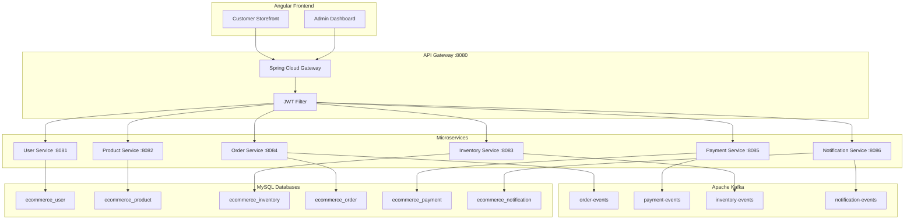
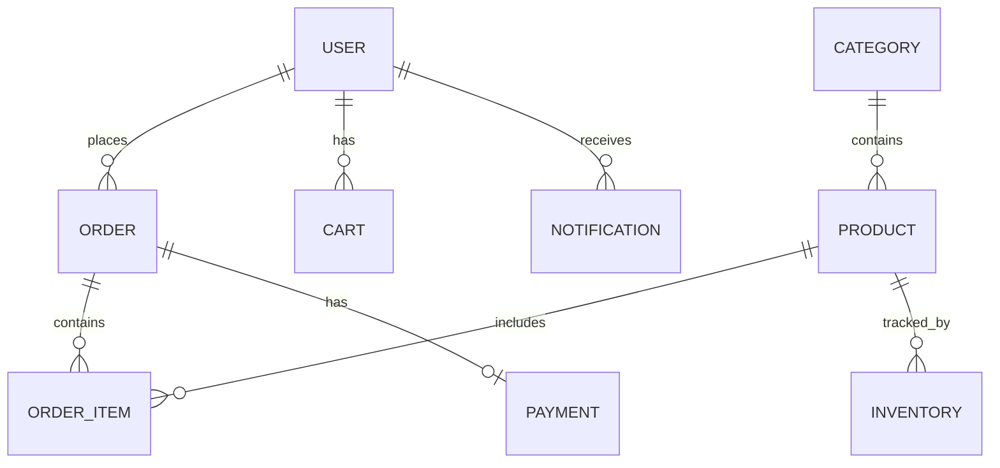
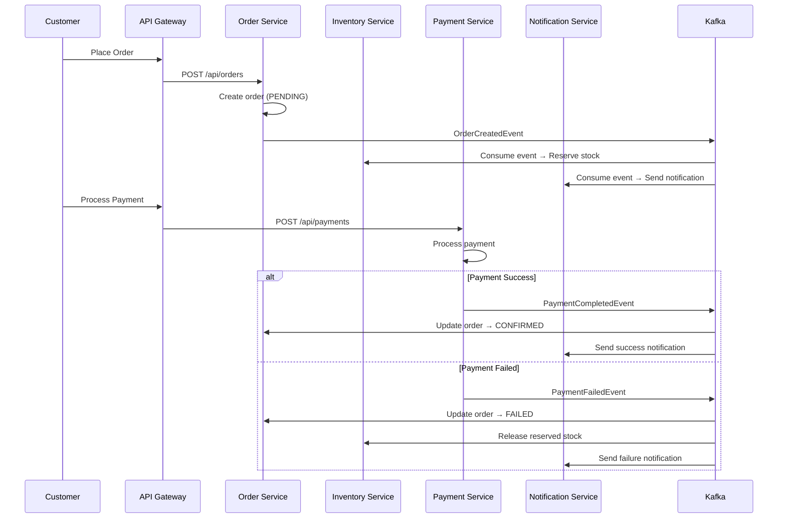
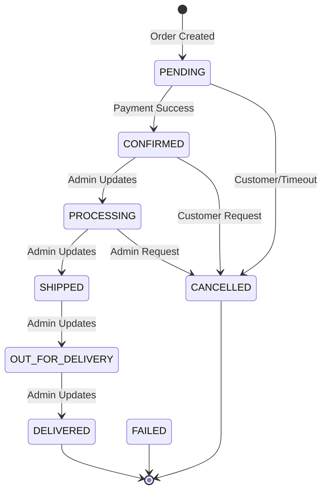

# 🛒 E-Commerce Order Management System

A full-stack microservices-based e-commerce platform built with **Java**, **Spring Boot**, **Apache Kafka**, **Angular**, and **MySQL**.

[](https://www.java.com)
[](https://spring.io/projects/spring-boot)
[](https://kafka.apache.org)
[](https://angular.dev)
[](https://www.mysql.com)
[](https://www.docker.com)
[](LICENSE)

---

## 📋 Table of Contents

- [Project Overview](#-project-overview)
- [Business Problem](#-business-problem)
- [Key Features](#-key-features)
- [Architecture](#-architecture)
- [Microservices](#-microservices)
- [Technology Stack](#-technology-stack)
- [Database Design](#-database-design)
- [Kafka Architecture](#-kafka-architecture)
- [Authentication & Security](#-authentication--security)
- [API Documentation](#-api-documentation)
- [Project Structure](#-project-structure)
- [Setup Instructions](#-setup-instructions)
- [Docker Setup](#-docker-setup)
- [Demo Credentials](#-demo-credentials)
- [Testing](#-testing)
- [Screenshots](#-screenshots)
- [Future Enhancements](#-future-enhancements)
- [Interview Topics](#-interview-topics)

---

## 📖 Project Overview

This is a complete end-to-end e-commerce application featuring:

- **7 Spring Boot microservices** with independent databases
- **Apache Kafka** for event-driven asynchronous communication
- **Angular 17** frontend with customer storefront and admin dashboard
- **JWT-based authentication** with role-based access control
- **Docker Compose** for one-command deployment
- **59 JUnit 5 + Mockito** unit tests

> **Note:** This is a portfolio project designed to demonstrate Java Full Stack development skills. It is not a production system.

---

## 🎯 Business Problem

Build an online shopping platform where customers can browse products, manage their shopping cart, checkout with various payment methods, and track their orders — while admins manage products, inventory, orders, and payments through a dedicated dashboard.

---

## ✨ Key Features

### Customer Features
- User registration and JWT authentication
- Product browsing with search, filter, sort, and pagination
- Shopping cart management (add, update, remove)
- Multi-step checkout with address and payment selection
- Simulated payment processing (Card, UPI, Net Banking, COD)
- Order tracking with visual timeline
- Order cancellation with inventory release
- Notification center with read/unread management
- Profile management

### Admin Features
- Dashboard with real-time statistics
- Product management (CRUD)
- Category management
- Inventory monitoring with stock status alerts
- Order management with status updates
- Payment history and filtering

### Architecture Features
- Event-driven communication via Kafka
- Database-per-service pattern
- API Gateway with JWT validation
- Global exception handling
- Consistent API response format
- Flyway database migrations

---

## 🏗️ Architecture

### High-Level Architecture



### Communication Patterns

| Pattern | Used For | Why |
|---------|----------|-----|
| **REST (Synchronous)** | Product lookup, inventory check, user auth | Immediate response required |
| **Kafka (Asynchronous)** | Order events, payment events, notifications | Decoupled, reliable, scalable |

---

## 🔧 Microservices

| Service | Port | Database | Responsibility |
|---------|------|----------|----------------|
| **API Gateway** | 8080 | — | Routing, JWT validation, CORS |
| **User Service** | 8081 | ecommerce_user | Registration, login, JWT, roles |
| **Product Service** | 8082 | ecommerce_product | Products, categories, search |
| **Inventory Service** | 8083 | ecommerce_inventory | Stock management, reservation |
| **Order Service** | 8084 | ecommerce_order | Cart, checkout, order lifecycle |
| **Payment Service** | 8085 | ecommerce_payment | Payment processing, refunds |
| **Notification Service** | 8086 | ecommerce_notification | Push notifications, alerts |

---

## 🛠️ Technology Stack

### Backend
- **Java 17** with modern language features
- **Spring Boot 3.x** with Spring MVC, Spring Data JPA
- **Spring Security** with JWT authentication
- **Hibernate** with Bean Validation
- **Spring Cloud Gateway** for API routing
- **Apache Kafka** for event-driven messaging
- **Flyway** for database migrations
- **Swagger/OpenAPI** for API documentation

### Frontend
- **Angular 17** with TypeScript
- Reactive Forms, HTTP Interceptors, Route Guards
- RxJS for reactive data flow
- Responsive design with modern UI

### Database & Infrastructure
- **MySQL 8.0** with database-per-service pattern
- **Docker & Docker Compose** for containerized deployment
- **Maven** for build management

### Testing
- **JUnit 5** + **Mockito** for unit tests
- **MockMvc** for controller tests
- 59 tests across 4 service test suites

---

## 🗄️ Database Design

Each microservice owns its own database schema, following the database-per-service pattern.

### Entity Relationships



### Database Schemas

| Database | Tables |
|----------|--------|
| ecommerce_user | users |
| ecommerce_product | products, categories |
| ecommerce_inventory | inventory |
| ecommerce_order | orders, order_items, carts, cart_items |
| ecommerce_payment | payments |
| ecommerce_notification | notifications |

---

## 📡 Kafka Architecture

### Event Topics

| Topic | Producer | Consumer(s) | Purpose |
|-------|----------|-------------|---------|
| order-events | Order Service | Inventory, Payment, Notification | New order placed |
| payment-events | Payment Service | Order, Notification | Payment success/failure |
| inventory-events | Inventory Service | Order, Notification | Stock reserved/released |
| notification-events | Order/Payment | Notification | Trigger notifications |

### Order Processing Flow



### Order State Machine



---

## 🔐 Authentication & Security

- **JWT tokens** for stateless authentication
- **BCrypt** password hashing
- **Role-based access control** (CUSTOMER, ADMIN)
- **API Gateway** validates JWT on all protected routes
- **Public routes:** `/api/auth/login`, `/api/auth/register`, `/api/products`, `/api/categories`
- **Protected routes:** All other endpoints require valid JWT

---

## 📚 API Documentation

Once running, access Swagger UI for each service:

| Service | Swagger URL |
|---------|-------------|
| User Service | http://localhost:18081/swagger-ui.html |
| Product Service | http://localhost:18082/swagger-ui.html |
| Inventory Service | http://localhost:18083/swagger-ui.html |
| Order Service | http://localhost:18084/swagger-ui.html |
| Payment Service | http://localhost:18085/swagger-ui.html |
| Notification Service | http://localhost:18086/swagger-ui.html |

---

## 📁 Project Structure

```
ecommerce-system/
├── api-gateway/                    # Spring Cloud Gateway
├── user-service/                   # Authentication & User management
├── product-service/                # Products & Categories
├── inventory-service/              # Stock management
├── order-service/                  # Orders & Cart
├── payment-service/                # Payment processing
├── notification-service/           # Notifications
├── frontend/                       # Angular 17 application
│   └── src/app/
│       ├── components/
│       │   ├── customer/           # Customer-facing pages
│       │   ├── admin/              # Admin dashboard pages
│       │   └── shared/             # Reusable components
│       ├── services/               # Angular services
│       ├── models/                 # TypeScript interfaces
│       └── guards/                 # Route guards
├── docs/                           # Documentation
│   ├── INTERVIEW_GUIDE.md
│   ├── RESUME_PROJECT_DESCRIPTION.md
│   └── screenshots/
├── docker-compose.yml
├── .env.example
├── e2e-test.js
├── pom.xml
└── README.md
```

---

## 🚀 Setup Instructions

### Prerequisites

- **Java 17+**
- **Node.js 18+** and npm
- **Docker & Docker Compose**
- **Maven 3.8+**

### Quick Start with Docker

```bash
# Copy environment variables
cp .env.example .env

# Build and start all services
docker-compose up --build -d

# Wait for services to start (~60 seconds), then access:
# Frontend:      http://localhost:14200
# API Gateway:   http://localhost:18090
```

### Local Development

```bash
# Start infrastructure
docker-compose up -d mysql kafka zookeeper

# Start each backend service (in separate terminals)
cd user-service && mvn spring-boot:run
cd product-service && mvn spring-boot:run
cd inventory-service && mvn spring-boot:run
cd order-service && mvn spring-boot:run
cd payment-service && mvn spring-boot:run
cd notification-service && mvn spring-boot:run
cd api-gateway && mvn spring-boot:run

# Start Angular frontend
cd frontend && npm install && ng serve
```

---

## 🐳 Docker Setup

The entire application runs with a single command:

```bash
docker-compose up --build -d
```

### Containers

| Container | Port | Status Check |
|-----------|------|-------------|
| ecommerce-mysql | 3306 | `docker exec ecommerce-mysql mysqladmin ping` |
| ecommerce-zookeeper | 2181 | `docker logs ecommerce-zookeeper` |
| ecommerce-kafka | 9092 | `docker logs ecommerce-kafka` |
| ecommerce-user-service | 18081 | `curl http://localhost:18081/actuator/health` |
| ecommerce-product-service | 18082 | `curl http://localhost:18082/actuator/health` |
| ecommerce-inventory-service | 18083 | `curl http://localhost:18083/actuator/health` |
| ecommerce-order-service | 18084 | `curl http://localhost:18084/actuator/health` |
| ecommerce-payment-service | 18085 | `curl http://localhost:18085/actuator/health` |
| ecommerce-notification-service | 18086 | `curl http://localhost:18086/actuator/health` |
| ecommerce-api-gateway | 18090 | `curl http://localhost:18090/actuator/health` |

### Stop Services

```bash
docker-compose down          # Stop containers
docker-compose down -v       # Stop and remove volumes (resets database)
```

---

## 🔑 Demo Credentials

> ⚠️ These are demo credentials for local development only.

| Role | Email | Password |
|------|-------|----------|
| Admin | admin@example.com | admin123 |
| Customer | customer1@example.com | customer123 |

**Note:** Register a new account through the application to test the full flow.

---

## 🧪 Testing

### Unit Tests

```bash
# Run all tests
mvn test

# Run specific service tests
cd user-service && mvn test
cd product-service && mvn test
cd order-service && mvn test
cd payment-service && mvn test
```

### Test Coverage

| Service | Tests | Scenarios |
|---------|-------|-----------|
| UserService | 13 | Register, login, profile, update, error cases |
| ProductService | 13 | CRUD, search, filter, categories, pagination |
| OrderService | 22 | Cart, checkout, cancel, state transitions |
| PaymentService | 11 | Process, success/failure, history |
| **Total** | **59** | |

### End-to-End Test

```bash
# Run the full E2E flow
node e2e-test.js
```

This tests: Register → Login → Browse → Cart → Checkout → Payment → Kafka Events → Order Confirmation

---

## 📸 Screenshots

> Screenshots will be added after running the application locally.
> Required screenshots:
> - Landing page
> - Product catalog with search/filter
> - Shopping cart
> - Checkout flow
> - Payment page
> - Order tracking
> - Admin dashboard
> - Admin product management

---

## 🔮 Future Enhancements

- [ ] Redis caching for product catalog
- [ ] Elasticsearch for advanced product search
- [ ] Kubernetes deployment with Helm charts
- [ ] CI/CD pipeline with GitHub Actions
- [ ] Prometheus + Grafana monitoring
- [ ] Distributed tracing with Zipkin
- [ ] Centralized configuration with Spring Cloud Config
- [ ] Service discovery with Eureka
- [ ] Dead letter topics for failed Kafka messages
- [ ] Cloud deployment (AWS/Azure)

---

## 💡 Interview Topics

This project demonstrates understanding of:

### Architecture
- **Why microservices?** Independent deployment, team autonomy, technology flexibility
- **Why Kafka?** Async communication, decoupling, reliability, scalability
- **Why REST + Kafka?** REST for sync operations (auth, queries), Kafka for async events (orders, payments)

### Key Workflows
- **Checkout flow:** Cart → Validate → Create Order → Reserve Inventory → Process Payment → Confirm
- **Payment failure:** Payment fails → Kafka event → Release inventory → Update order status → Notify customer
- **Order cancellation:** Validate state → Cancel → Release inventory → Refund simulation → Notify

### Technical Concepts
- JWT authentication and role-based authorization
- Database-per-service pattern and eventual consistency
- Optimistic locking for inventory concurrency
- Event-driven architecture and Kafka consumer groups
- API Gateway routing and cross-cutting concerns

See [docs/INTERVIEW_GUIDE.md](docs/INTERVIEW_GUIDE.md) for detailed Q&A.
